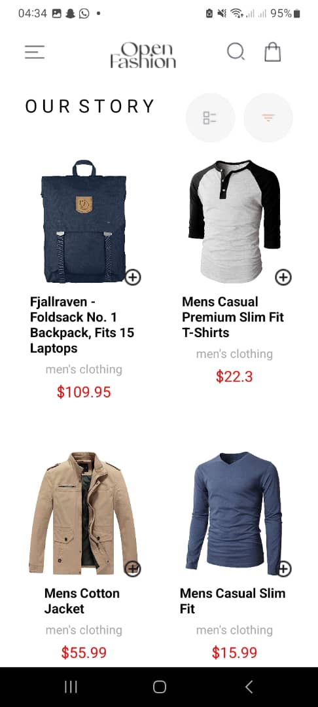
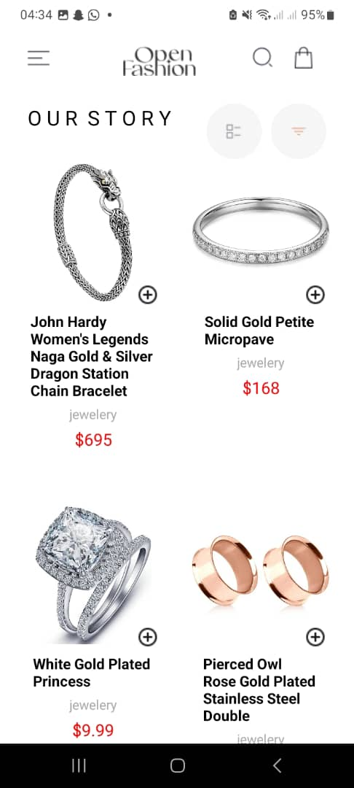
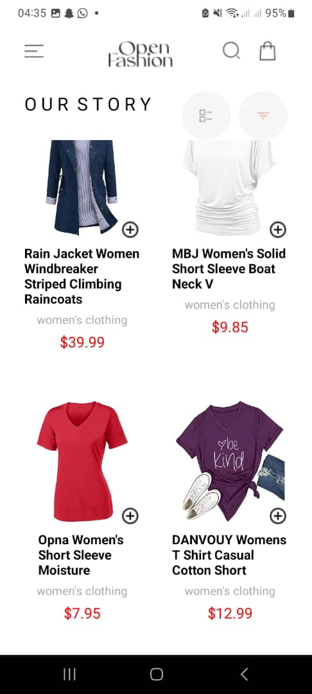
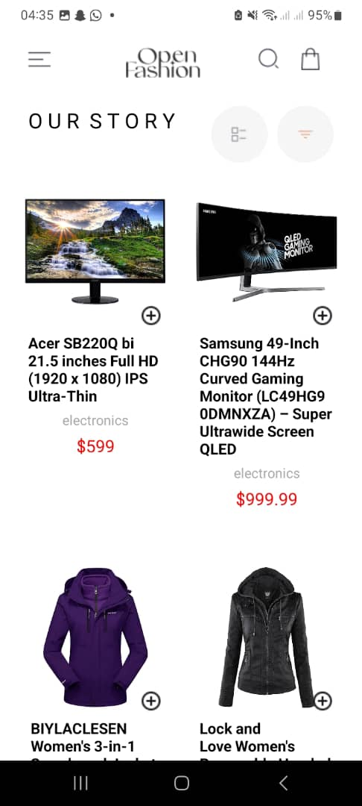
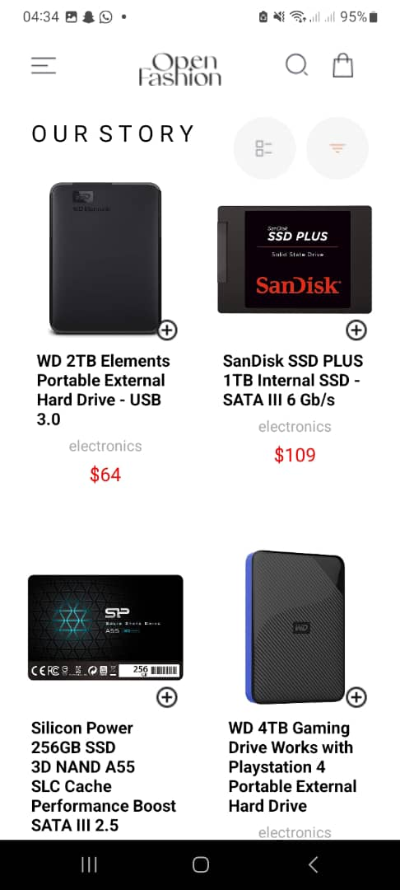
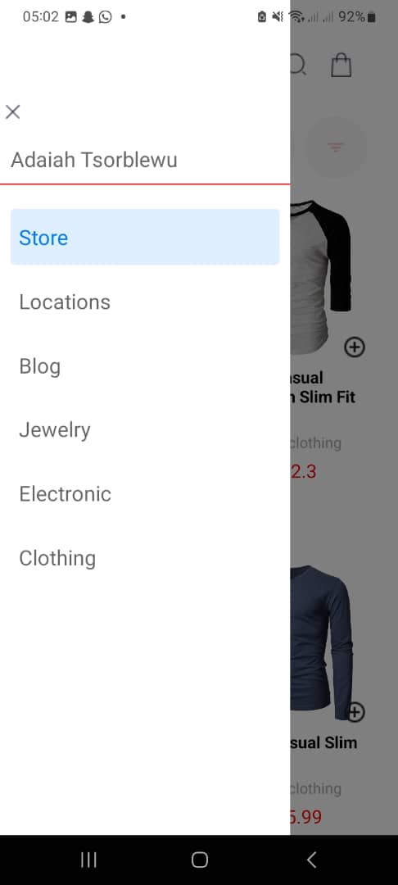
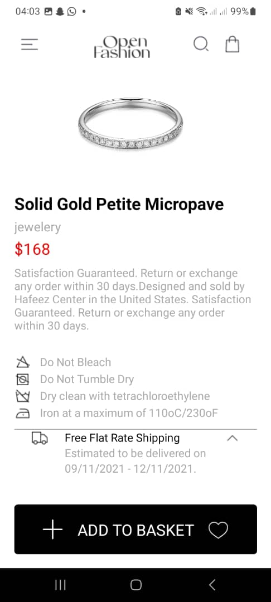
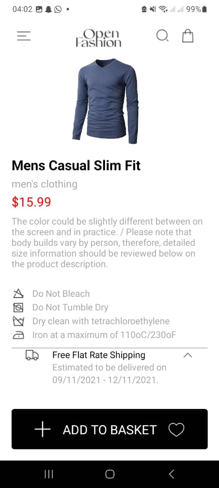

# rn-assignment7-11019725

## My design choices and how I implemented data storage

- I created four component files:

  - HomeScreen
  - ProductDetailScreen
  - CartScreen
  - CustomDrawerContent

- Each of the files listed above contain the layout of how the App must look like.
- i went about it this way to pevent the Code from looking clustered to ensure that when I ccome back to review the code to check for any updates that needs to be made i would be able to do so without confusions of what belongs where.
- The customDrawer content contains the menu items. these menu items can be accesed by swiping from left to reight at the corner of the screen or on press of the menu icon. It was implemented based on the installation drawer navigation.
- The HomeCreen component contains product items these product item were made accessible by implementing an external api using fetch and ayncStorage to store and retrieve data.

- Fetch data Implementation

  - All this was done efficiently with the use of 'useEffect' hook which performs side effects. For example useEffect is used to fetch data from the API when the component mounts.
  - Fetching data uses the fetch function to make a GET request to the https://fakestoreapi.com/products endpoint.
  - When a response is made, products are parsed to JSON, 'setProduct' updater is called to store the data.

- Async Data Storage Implementation

  - Here, useEffect hook loads cart items from asyncStorage when component mounts.
  - I defined a 'loadCartItem' function to load cart items from AsyncStorage.
  - I also used 'AsyncStorage,get.Item' to retrieve the cart items stored under '@cart_items' key.
  - i made sure if there are 'stored cart items' they are parsed from JSON and the setCartItems state updater is called to store them in the state.

- Some of major functions implemented includes:

  - AddToCart function: for adding items to cart.
  - Remove from cart
  - Creating a new cart: thus, new cart items are created
  - updating state: setCartItem is called to update the state with new cart items
  - and saving them to AsyncStorage as stated previously

- On press on product detail one is able to view the decription of product

## screenshots of the app.

### Home

### MenuList

### ProductDescription

